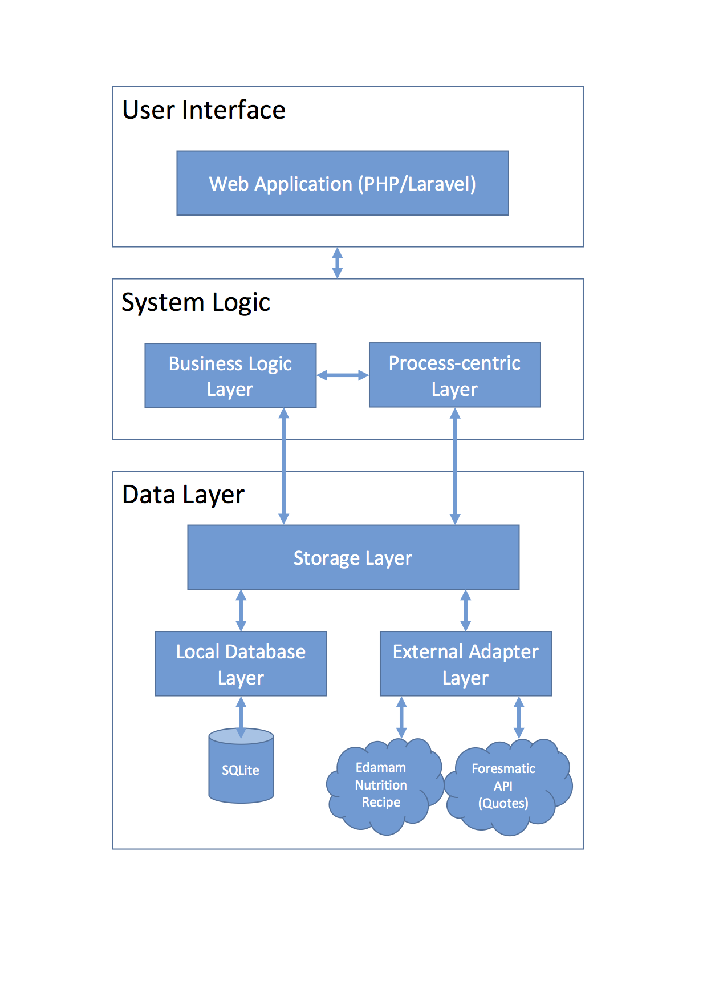

# HealthBuddy - IntroSDE Final Project

This project was developed as the final project for the course Introduction to Service Design and Engineering of University of Trento, trento, Italy.

## Description

For this assignment we have developed a web application with which users can improve their lifestyle. We track different health measures to give insight into the user’s health conditions so that they become aware of their health condition. Furthermore the user can set goals and activities to motivate him-/herself to go out and exercise / socialise. Finally users can insert their nutrition intake.

## Group Members
- Sarmad Saleem
- Remco Kortekaas

## Layers

- LocalDB : [https://healthbuddy-localdb.herokuapp.com/](https://healthbuddy-localdb.herokuapp.com/)
- Storage : [https://healthbuddy-storage.herokuapp.com/](https://healthbuddy-storage.herokuapp.com/)
- External Adapter : [https://healthbuddy-externaladapter.herokuapp.com/](https://healthbuddy-externaladapter.herokuapp.com/)
- Business Logic : [https://healthbuddy-businesslogic.herokuapp.com/](https://healthbuddy-businesslogic.herokuapp.com/)
- Process Centric : [https://healthbuddy-processcentric.herokuapp.com/](https://healthbuddy-processcentric.herokuapp.com/)
- Client: [http://162.243.171.132/](http://162.243.171.132/) 

## Repositories

- LocalDB : [https://github.com/introsde-healthbuddy/LocalDB](https://github.com/introsde-healthbuddy/LocalDB)
- Storage : [https://github.com/introsde-healthbuddy/Storage](https://github.com/introsde-healthbuddy/Storage)
- External Adapter : [https://github.com/introsde-healthbuddy/ExternalAdapter](https://github.com/introsde-healthbuddy/ExternalAdapter)
- Business Logic : [hhttps://github.com/introsde-healthbuddy/BusinessLogic](https://github.com/introsde-healthbuddy/BusinessLogic)
- Process Centric : [https://github.com/introsde-healthbuddy/ProcessCentric](https://github.com/introsde-healthbuddy/ProcessCentric)
- Client: [http://162.243.171.132/](http://162.243.171.132/) 

## Wikis

- LocalDB : [https://github.com/introsde-healthbuddy/LocalDB/wiki](https://github.com/introsde-healthbuddy/LocalDB/wiki)
- Storage : [https://github.com/introsde-healthbuddy/Storage/wiki](https://github.com/introsde-healthbuddy/Storage/wiki)
- External Adapter : [https://github.com/introsde-healthbuddy/ExternalAdapter/wiki](https://github.com/introsde-healthbuddy/ExternalAdapter/wiki)
- Business Logic : [hhttps://github.com/introsde-healthbuddy/BusinessLogic/wiki](https://github.com/introsde-healthbuddy/BusinessLogic/wiki)
- Process Centric : [https://github.com/introsde-healthbuddy/ProcessCentric/wiki](https://github.com/introsde-healthbuddy/ProcessCentric/wiki)
- Client: [http://162.243.171.132/](http://162.243.171.132/) 

##External APIs
- Forismatic API
- Edamam Receipe API

## Demo User Details
- Email: sarmad.saleem@live.com
- Password: qwerty

## Architecture

The application consists of six services that work independently. The interaction between the services are done using SOAP or REST technologies. The architecture of the application consists of following services:

* **Local Database Service:** 
 * Developed using SOAP web protocol. 
 * Interacts directly with the local SQLite database and creates the classes for all the tables.
* **Adapter Service:** 
 * Developed using REST architectural style. 
 * Responsible for interacting with external APIs, such as Instagram API, Forismatic API and Quoteondesign API, for requesting data through their APIs.
* **Storage Service:**
 * Developed using REST architectural style
 * Works as a middleman between the data sources and other services. Talks with the Local Database Service and Adapter Service and provides the data to other services in the application.
* **Business Logic Service:**
 * Developed using REST architectural style
 * Handles the GET/DELETE requests coming from the User Interface layer: gets requests from the UI, asks proper data from Storage Service, processes it and sends it to the UI.
 * Handles the calculations if a user has reached a goal or not: gets the posted measure from Process Centric Services, gets the person goals, makes the calculations, gets timeline item, processes it and send it back to Process Centric Service.  
* **Process Centric Service:**
 * Developed using REST architectural style
 * Handles the POST/PUT requests coming from the User Interface layer
 * Interacts with Storage Service for POST/PUT requests and Business Logic Service for checking if the user has reached its goals when new measures are posted.  
* **Web Application (Client):**
 * Laravel powered web application that consumes REST & SOAP based web services to realize HealthBuddy

  